# AI Startup Consultant & Strategic Business Analysis Platform

A multi-agent strategic business consulting platform built with **LangGraph**, **FastAPI**, **Groq AI**, and **MongoDB**. The platform deploys **15 specialized autonomous AI agents** to conduct parallel market research, competitor analysis, financial modeling, marketing strategy, SWOT analysis, and investment readiness evaluations for any startup idea or business concept.

---

## Features

- **15 Autonomous AI Consulting Agents**:
  - **Market Research Agent**: Industry sizing, growth rates, and market trends (powered by DuckDuckGo live web search).
  - **Competitor Analysis Agent**: Direct/indirect competitor landscapes and moat strategies (powered by DuckDuckGo live web search).
  - **Customer Research Agent**: Target personas, pain points, and customer acquisition strategies.
  - **Business Model Agent**: Revenue streams, cost structures, and value propositions.
  - **Product Strategy Agent**: Feature prioritization, MVP roadmap, and product-market fit.
  - **Branding Agent**: Positioning, brand identity, and tone of voice.
  - **Marketing Agent**: Growth channels, CAC strategy, and content marketing plans.
  - **Sales Strategy Agent**: Direct sales, B2B/B2C sales funnels, and conversion optimization.
  - **Financial Planning Agent**: Revenue projections, unit economics, and burn rate estimation.
  - **Operations Agent**: Supply chain, logistics, tech stack, and operational workflows.
  - **Risk Assessment Agent**: Legal, compliance, market, and operational risk matrix.
  - **SWOT Analysis Agent**: Strategic matrix of Strengths, Weaknesses, Opportunities, and Threats.
  - **Growth Strategy Agent**: Expansion channels, scaling triggers, and viral loops.
  - **Investor Readiness Agent**: Pitch deck narrative, key metrics required, and investor Q&A prep.
  - **Final Report Generator Agent**: Aggregates and synthesizes analysis from all 14 parallel nodes into an executive strategic report.

- **Real-Time Streaming & Visualizer**:
  - Track live progress and execution logs from all agents in real-time via **Server-Sent Events (SSE)**.

- **Direct Cloud/Local MongoDB Storage**:
  - Asynchronously stores and indexes strategic reports in **MongoDB**.

- **Sleek Web Dashboard**:
  - Single-page application UI for inputting business briefs, streaming agent activities, viewing executive reports, and browsing historical reports.

---

## Architecture

```mermaid
graph TD
    User([User / Web Dashboard]) -->|POST /api/analyze| FastAPI[FastAPI Backend Server]
    FastAPI -->|Background Task| LG[LangGraph Execution Engine]
    
    subgraph LangGraph Multi-Agent System
        Initiator[Initiator Agent] --> MR[Market Research Agent]
        Initiator --> CA[Competitor Analysis Agent]
        Initiator --> CR[Customer Research Agent]
        Initiator --> BM[Business Model Agent]
        Initiator --> PS[Product Strategy Agent]
        Initiator --> BR[Branding Agent]
        Initiator --> MK[Marketing Agent]
        Initiator --> SS[Sales Strategy Agent]
        Initiator --> FP[Financial Planning Agent]
        Initiator --> OP[Operations Agent]
        Initiator --> RA[Risk Assessment Agent]
        Initiator --> SWOT[SWOT Analysis Agent]
        Initiator --> GS[Growth Strategy Agent]
        Initiator --> IR[Investor Readiness Agent]
        
        MR --> WebSearch[DuckDuckGo Live Web Search]
        CA --> WebSearch
        
        MR --> FR[Final Report Generator]
        CA --> FR
        CR --> FR
        BM --> FR
        PS --> FR
        BR --> FR
        MK --> FR
        SS --> FR
        FP --> FR
        OP --> FR
        RA --> FR
        SWOT --> FR
        GS --> FR
        IR --> FR
    end
    
    FR -->|Save Report| DB[(Database: MongoDB)]
    FastAPI -->|SSE Stream /api/analyze/stream| User
```



---

## Project Structure

```
BUSINESS_ANALYSIS/
├── backend/
│   ├── agents/
│   │   ├── prompts/         # Prompts for 15 AI agents
│   │   ├── graph.py         # LangGraph StateGraph pipeline configuration
│   │   ├── llm.py           # Groq AI API interaction layer
│   │   ├── nodes.py         # Node handlers for all 15 agents
│   │   ├── search.py        # Web search utility (DuckDuckGo API)
│   │   └── state.py         # LangGraph AgentState definition
│   ├── config.py            # Environment & app configuration settings
│   ├── database.py          # MongoDB storage layer
│   ├── main.py              # FastAPI app endpoints and static file serving
│   └── requirements.txt     # Python dependencies
├── frontend/
│   ├── css/                 # Modern styling
│   ├── js/                  # Real-time event handling & API clients
│   ├── index.html           # Main analysis generator & live progress UI
│   ├── report.html          # Comprehensive strategic report view
│   └── history.html         # Saved reports list & history viewer
├── .env                     # Environment variables configuration
└── README.md                # Project documentation
```

---

## Prerequisites & Setup

### Prerequisites
- **Python**: `3.10` or higher
- **Groq API Key** (Optional, recommended for live AI generation)
- **MongoDB** (Optional, defaults to local JSON storage if not running)

---

### Step-by-Step Installation

1. **Clone the repository**:
   ```bash
   git clone <repository-url>
   cd BUSINESS_ANALYSIS
   ```

2. **Create & activate a virtual environment**:
   - **Windows**:
     ```powershell
     python -m venv venv
     .\venv\Scripts\activate
     ```
   - **macOS / Linux**:
     ```bash
     python3 -m venv venv
     source venv/bin/activate
     ```

3. **Install dependencies**:
   ```bash
   pip install -r backend/requirements.txt
   ```

4. **Configure environment variables**:
   Create or edit `.env` in the root directory:
   ```env
   GROQ_API_KEY=your_groq_api_key_here
   MONGODB_URL=mongodb://localhost:27017
   DATABASE_NAME=startup_consultant
   PORT=8000
   HOST=127.0.0.1
   ```

5. **Start the application**:
   ```bash
   python -m uvicorn backend.main:app --reload
   ```

6. **Access the Dashboard**:
   Open your browser and navigate to:
   [http://127.0.0.1:8000](http://127.0.0.1:8000)

---

## API Reference

| Method | Endpoint | Description |
| :--- | :--- | :--- |
| `GET` | `/api/status` | Check system status, active database engine, and Groq API state. |
| `POST` | `/api/analyze` | Submit a startup brief to initiate multi-agent execution. |
| `GET` | `/api/analyze/stream/{task_id}` | SSE stream for real-time progress updates and log messages. |
| `GET` | `/api/reports` | List all saved business analysis reports. |
| `GET` | `/api/reports/{report_id}` | Fetch full detailed report by ID. |
| `DELETE` | `/api/reports/{report_id}` | Delete a saved report by ID. |

---

## License

This project is licensed under the MIT License.
