# AI Startup Consultant & Strategic Business Analysis Platform

A production-grade, multi-agent strategic business consulting and enterprise intelligence platform built with **LangGraph**, **FastAPI**, **Groq AI (Llama 3 / Mixtral / OSS models)**, **Grok**, and **MongoDB**. The platform deploys **15 specialized autonomous AI agents** to conduct deep, parallel market research, competitor benchmarking, financial modeling with dynamic global currency conversion, SWOT matrix analysis, and investor pitch deck preparation for any startup idea or business vertical.

Additionally includes an **Interactive AI Strategy Consultant Chatbot** with multi-turn context memory and full-screen reading capabilities.

---

## Key Features

### 1. 15 Autonomous AI Consulting Agents
- **Market Research Agent**: Industry TAM/SAM/SOM sizing, CAGR, and macro market trends powered by DuckDuckGo live web search.
- **Competitor Analysis Agent**: Direct, indirect, and adjacent competitor intelligence, pricing tiers, and defensible moats.
- **Customer Research Agent**: ICP personas, buyer psychology, friction points, and customer acquisition channels.
- **Business Model Agent**: Monetization models, pricing strategies, and value proposition architecture.
- **Product Strategy Agent**: Feature prioritization matrix, MVP phased roadmap, and product-market fit metrics.
- **Branding Agent**: Brand archetype, positioning statements, visual identity cues, and voice/tone frameworks.
- **Marketing Agent**: Omnichannel acquisition mix, organic/paid GTM playbooks, and CAC optimization.
- **Sales Strategy Agent**: Direct sales motions, enterprise B2B sales cycles, pipeline velocity, and conversion funnels.
- **Financial Planning Agent**: 3–5 year revenue projections, COGS, gross margins, CAC, LTV, and runway burn estimates.
- **Operations Agent**: Core tech stack, operational infrastructure, compliance standards, and supply chain logistics.
- **Risk Assessment Agent**: Regulatory, market, financial, and operational risk mitigation matrices.
- **SWOT Analysis Agent**: 2x2 matrix of Strengths, Weaknesses, Opportunities, and Threats.
- **Growth Strategy Agent**: Viral loops, expansion playbooks, partnerships, and horizontal/vertical scaling triggers.
- **Investor Readiness Agent**: Seed to Series A pitch deck narratives, traction milestones, and investor Q&A prep.
- **Final Report Generator Agent**: Synthesizes and formats cross-functional agent intelligence into a unified 20-section executive dossier.

### 2. Multi-Currency Global Financial Engine
- Automatic localized currency detection and conversion across **25+ global economies** (USD `$`, INR `₹`, EUR `€`, GBP `£`, AED `AED`, SGD `S$`, JPY `¥`, CAD `C$`, AUD `A$`, SAR `SAR`, BRL `R$`, CHF `CHF`, etc.).
- Region-specific cost structure adjustments and dynamic multiplier calculations (`backend/agents/currency_helper.py`).

### 3. Real-Time AI Strategy Consultant Chatbot
- **Interactive Multi-Turn Advisory**: Ask on-demand questions regarding unit economics, GTM playbooks, TAM sizing, and pitch strategy.
- **Context Injection**: Automatically leverages current business vision and industry vertical parameters.
- **Markdown & Table Rendering**: Cleanly renders structured Markdown tables, lists, and code blocks.
- **Expandable Full-Screen Mode**: One-click fullscreen expand modal with extended scrolling for comprehensive reading.
- Available as an inline dashboard widget (`index.html`) and as a standalone executive advisory interface (`chat.html`).

### 4. Real-Time Streaming & Visualizer
- Server-Sent Events (**SSE**) stream live progress, active agent status, and real-time execution logs.
- Dynamic 15-step agent execution board with live activity terminal.

### 5. Interactive Strategic Dossier & Storage
- **Chart.js Projections**: 3-Year revenue forecasts, expense breakdowns, and visual unit economics.
- **MongoDB Persistence**: Asynchronous saving, indexing, filtering, and retrieval of generated business reports with automatic local fallback.
- **Print & PDF Ready**: Dedicated print stylesheet (`css/print.css`) for boardroom-ready report printing and export.

---

## Architecture

```mermaid
graph TD
    User([User / Web Dashboard]) -->|POST /api/analyze| FastAPI[FastAPI Backend Server]
    FastAPI -->|Background Task| LG[LangGraph Execution Engine]
    
    subgraph Multi-Agent Intelligence Network
        Initiator[Initiator Agent] --> MR[Market Research Agent]
        Initiator --> CA[Competitor Analysis Agent]
        Initiator --> CR[Customer Research Agent]
        Initiator --> BM[Business Model Agent]
        Initiator --> PS[Product Strategy Agent]
        Initiator --> BR[Branding Agent]
        Initiator --> MK[Marketing Agent]
        Initiator --> SS[Sales Strategy Agent]
        Initiator --> FP[Financial Planning Agent]
        Initiator --> OP[Operations Agent]
        Initiator --> RA[Risk Assessment Agent]
        Initiator --> SWOT[SWOT Analysis Agent]
        Initiator --> GS[Growth Strategy Agent]
        Initiator --> IR[Investor Readiness Agent]
        
        MR --> WebSearch[DuckDuckGo Live Search Engine]
        CA --> WebSearch
        
        MR --> FR[Final Report Generator]
        CA --> FR
        CR --> FR
        BM --> FR
        PS --> FR
        BR --> FR
        MK --> FR
        SS --> FR
        FP --> FR
        OP --> FR
        RA --> FR
        SWOT --> FR
        GS --> FR
        IR --> FR
    end
    
    FR -->|Save Strategic Report| DB[(MongoDB / Local Fallback)]
    FastAPI -->|SSE Stream /api/analyze/stream| User
    User <-->|POST /api/chat| Chatbot[AI Consultant Chat Engine]
```



---

## Project Structure

```
BUSINESS_ANALYSIS/
├── backend/
│   ├── agents/
│   │   ├── prompts/             # System prompts for 15 specialized agents
│   │   ├── check_astream.py     # Stream verification helper
│   │   ├── currency_helper.py   # Global multi-currency formatting & conversion
│   │   ├── graph.py             # LangGraph StateGraph pipeline definition
│   │   ├── llm.py               # Groq / Grok API client with rate-limit backoff
│   │   ├── nodes.py             # Node execution handlers for all 15 agents
│   │   ├── search.py            # DuckDuckGo live search engine integration
│   │   └── state.py             # LangGraph AgentState schema
│   ├── chatbot.py               # AI Strategy Consultant chatbot router & logic
│   ├── config.py                # App configuration & environment loader
│   ├── database.py              # MongoDB async motor client & local fallback
│   ├── main.py                  # FastAPI application entrypoint & static mounting
│   └── requirements.txt         # Backend Python dependencies
├── frontend/
│   ├── css/
│   │   ├── base.css             # Base reset, layout grid, headers, and container styles
│   │   ├── chat.css             # Chatbot widget & fullscreen modal styling
│   │   ├── components.css       # Form inputs, buttons, glass cards, and status badges
│   │   ├── print.css            # Print stylesheet for PDF/paper report export
│   │   ├── style.css            # Master stylesheet bundler
│   │   ├── variables.css        # SaaS design tokens, gradients, and shadows
│   │   └── views.css            # Runner panels, logs terminal, and report layout
│   ├── js/
│   │   ├── api.js               # Backend API communication layer
│   │   ├── app.js               # Main form handling & SSE streaming orchestrator
│   │   ├── chat.js              # StrategyChatbot controller & markdown renderer
│   │   ├── config.js            # Frontend configuration constants
│   │   ├── history.js           # Past reports manager, search, and delete
│   │   ├── report-viewer.js     # Comprehensive report view & Chart.js renderer
│   │   └── utils.js             # Currency formatting, toast notifications, DOM helpers
│   ├── index.html               # Main application interface & strategy generator
│   ├── chat.html                # Standalone full-page AI Strategy Consultant chat
│   ├── history.html             # Past reports archive & management
│   └── report.html              # Executive strategic analysis dossier viewer
├── .env                         # Environment variables configuration
└── README.md                    # Project documentation
```

---

## Getting Started

### Prerequisites
- **Python**: `3.10` or higher
- **Groq API Key** (Recommended for ultra-fast generation via Llama 3 / OSS models)
- **MongoDB** (Optional; automatically falls back to local storage if MongoDB is not running)

---

### Step-by-Step Installation

1. **Clone the repository**:
   ```bash
   git clone https://github.com/utk468/business-analyst.git
   cd BUSINESS_ANALYSIS
   ```

2. **Create & activate a virtual environment**:
   - **Windows**:
     ```powershell
     python -m venv venv
     .\venv\Scripts\activate
     ```
   - **macOS / Linux**:
     ```bash
     python3 -m venv venv
     source venv/bin/activate
     ```

3. **Install dependencies**:
   ```bash
   pip install -r backend/requirements.txt
   ```

4. **Configure environment variables**:
   Create a `.env` file in the root directory:
   ```env
   GROQ_API_KEY=gsk_your_groq_api_key_here
   GROQ_MODEL=openai/gpt-oss-120b
   MONGODB_URL=mongodb://localhost:27017
   DATABASE_NAME=startup_consultant
   PORT=8000
   HOST=127.0.0.1
   ```

5. **Run the server**:
   ```bash
   python -m uvicorn backend.main:app --reload --port 8000
   ```

6. **Open the Web Interface**:
   Navigate to [http://127.0.0.1:8000](http://127.0.0.1:8000) in your browser.

---

## API Reference

| Method | Endpoint | Description |
| :--- | :--- | :--- |
| `GET` | `/api/status` | Health check endpoint returning DB connectivity and AI engine status. |
| `POST` | `/api/analyze` | Initiates the 15-agent autonomous strategy analysis pipeline. |
| `GET` | `/api/analyze/stream/{task_id}` | Real-time Server-Sent Events (SSE) stream for agent progress and logs. |
| `POST` | `/api/chat` | Multi-turn conversational AI Strategy Advisor endpoint with context injection. |
| `GET` | `/api/chat/suggestions` | Returns strategic advisory quick prompt suggestions. |
| `GET` | `/api/reports` | Retrieves all stored business analysis reports. |
| `GET` | `/api/reports/{report_id}` | Retrieves a single complete strategic report by ID. |
| `DELETE` | `/api/reports/{report_id}` | Deletes a stored strategy report by ID. |

---

## License

This project is licensed under the MIT License.
